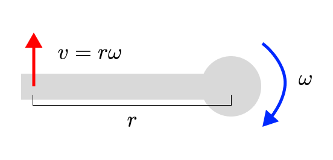
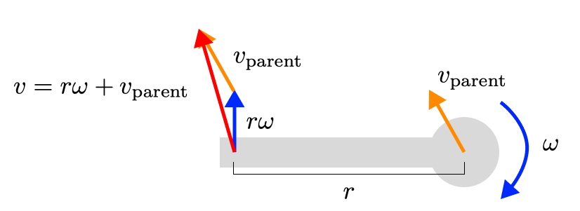

Data: Accelerometers, Gyros and Magnetometers
===============================================

Inertial measurement units (IMUs) contain an accelerometer and a gyroscope. Often they also contain a magnetometer.
These sensors are used to estimate the orientation of the device, using the linear acceleration, rotational velocity, and magnetic field sensed by the device.
When you strap (a set of) IMUs to a person, you can try to estimate the pose, velocity, and acceleration of the person.
This has advantages over optical mocap (either with markers or markerless), because it can be worn on the body (which means it can go with you outside of the lab), and it can directly measure velocity and acceleration (which requires finite differencing with optical motion capture systems).

IMUs are common, in both motion capture and in wearable devices like smart watches, smart glasses, smart shoes, and smart shoes.

Representing IMUs in Nimble
################################

To represent accelerometers and gyroscopes, you'll use a pair of a :code:`nimble.dynamics.BodyNode` (the bone that the sensor is rigidly attached to) and a :code:`nimble.math.Isometry3` (the translation and rotation of the sensor in that bone's frame). So that means you'll have a :code:`List[Pair[BodyNode, Isometry3]]` for the accelerometers, and another list for the gyroscopes (probably identical, if you're using IMUs which bundle both sensors together).

With a known state for your skeleton (position, velocity, acceleration), you can generate virtual gyroscope and accelerometer readings. For simplicity, let's imagine we are working with a single IMU inside of a smart watch on the left wrist::

  import nimblephysics as nimble
  import numpy as np
  import time

  rajagopal_opensim: nimble.biomechanics.OpenSimFile = nimble.RajagopalHumanBodyModel()
  skeleton: nimble.dynamics.Skeleton = rajagopal_opensim.skeleton

  right_wrist: nimble.dynamics.Joint = skeleton.getJoint("radius_hand_r")
  translation: np.ndarray = np.array([0.0, 0.05, 0.0])
  rotation: np.ndarray = np.eye(3)
  watch_offset: nimble.math.Isometry3 = nimble.math.Isometry3(rotation, translation)

  sensors: List[Pair[nimble.dynamics.BodyNode, nimble.math.Isometry3]] = [(right_wrist, watch_offset)]

  # Set the initial state of the skeleton to whatever you want
  skeleton.setGravity(np.array([0.0, -9.81, 0.0]))
  skeleton.setPositions(skeleton.getRandomPose()) # this generates a pose within legal joint limits
  skeleton.setVelocities(skeleton.getRandomVelocity())
  skeleton.setAccelerations(np.random.randn(skeleton.getNumDofs()))

  # Compute some noiseless sensor readings
  watch_acc = skeleton.getAccelerometerReadings(sensors)
  watch_rot_vel = skeleton.getGyroReadings(sensors)

Estimating Joint Velocity and Acceleration given IMU Readings
#############################################################

It turns out, if you hold the position of the skeleton fixed, then solving for the joint velocities 
given the gyro readings is a linear problem.
Then, if you hold the position and velocity of the skeleton fixed, then solving for the joint 
accelerations given the accelerometer readings is also a linear problem.
The Jacobians relating joint velocities to sensor readings is an exact function relating any amount 
of change of joint velocity to change in sensor reading. Likewise for acceleration. So you can use a 
linear least squares solver to solve for the joint velocities and accelerations.

This may at first feel too good to be true, so let me try to provide some simple intuition about why 
these relationships are linear.

Let's start with sensor velocity and joint velocity. If we have a sensor at the end of a pole (a bone), which is 
rotating around a fixed point (a joint), then the velocity of the sensor is linearly related to the velocity 
of the joint (by the length of the pole). Regardless of how fast that pole is rotating around its pivot, 
increasing the rotation speed by 1 radian per second will *always* increase the velocity of the sensor by 
the length of the pole.

If we begin adding a translational velocity to the joint as well (perhaps from its parent), we can simply 
add that to the velocity of the sensor. Also a linear operation!

You can scale up this intuition to a whole skeleton, with every joint's velocity linearly changing the (linear and rotational) velocities of any sensors below it on the tree.
The code to compute the Jacobian for gyroscopes is :code:`skeleton.getGyroReadingsJacobianWrt(sensors, wrt=nimble.neural.WithRespectTo.WRT_VELOCITY)`.

Acceleration has no effect on the velocity of the sensor (at least, not immediately). So the velocity of the
sensor is linearly related to the velocity of the joint, regardless of the acceleration of the joint.

A similar set of reasoning applies to the relationship between sensor acceleration and joint acceleration.
It turns out, actually, that the relationship is *literally identical* to the relationship between sensor 
velocity and joint velocity. Just take the time derivative of both sides, and the relationship (ie the Jacobian) remains exactly the same.

You can also scale up this intuition to a whole skeleton, with every joint's velocity linearly changing the (linear and rotational) velocities of any sensors below it on the tree.
The code to compute the Jacobian for gyroscopes is :code:`skeleton.getAccelerometerReadingsJacobianWrt(sensors, wrt=nimble.neural.WithRespectTo.WRT_ACCELERATION)`.

The last thing to note is that the relationship between sensor readings and joint velocities and accelerations.
This, sadly, is *not* a linear relationship. Increasing the rotational velocity of a joint increases the centripetal 
acceleration of the sensor with a squared term. You can still compute the Jacobian, but now instead of being a precise 
function it is simply the first order Taylor approximation of the relationship. The code to compute the Jacobian for 
acccelerometers is :code:`skeleton.getAccelerometerReadingsJacobianWrt(sensors, wrt=nimble.neural.WithRespectTo.WRT_VELOCITY)`.

If you first solve for the joint velocities using the gyroscope data (and you trust those velocities), then you can be held 
fixed and this non-linear relationship between joint velocities and accelerations can be irrelevant.

So let's dive into some code::

  import nimblephysics as nimble
  import numpy as np
  import time

  rajagopal_opensim: nimble.biomechanics.OpenSimFile = nimble.RajagopalHumanBodyModel()
  skeleton: nimble.dynamics.Skeleton = rajagopal_opensim.skeleton

  right_wrist: nimble.dynamics.Joint = skeleton.getJoint("radius_hand_r")
  translation: np.ndarray = np.array([0.0, 0.05, 0.0])
  rotation: np.ndarray = np.eye(3)
  watch_offset: nimble.math.Isometry3 = nimble.math.Isometry3(rotation, translation)

  sensors: List[Pair[nimble.dynamics.BodyNode, nimble.math.Isometry3]] = [(right_wrist, watch_offset)]

  # Set the initial state of the skeleton
  skeleton.setGravity(np.array([0.0, -9.81, 0.0]))
  skeleton.setPositions(skeleton.getRandomPose()) # this generates a pose within legal joint limits

  # Some random sensor readings
  watch_acc = np.random.randn(3)
  watch_rot_vel = np.random.randn(3)

  # Solve for the (least-squares) joint velocities
  d_rot_vel_d_vel: np.ndarray = skeleton.getGyroReadingsJacobianWrt(sensors, wrt=nimble.neural.WithRespectTo.WRT_VELOCITY)
  vel: np.ndarray = np.linalg.lstsq(d_rot_vel_d_vel, watch_rot_vel, rcond=None)[0]
  skeleton.setVelocities(vel)

  # Solve for the (least-squares) joint accelerations
  d_lin_acc_d_acc: np.ndarray = skeleton.getAccelerometerReadingsJacobianWrt(sensors, wrt=nimble.neural.WithRespectTo.WRT_ACCELERATION)
  acc: np.ndarray = np.linalg.lstsq(d_lin_acc_d_acc, watch_acc, rcond=None)[0]
  skeleton.setAccelerations(acc)

Estimating Poses given IMU Readings
########################################

This is a non-linear problem, with lots of existing research, and lots more work to be done. We can point you at the necessary Jacobians to get started.

Here is a list of the relevant Jacobians:

- :math:`\frac{\partial g}{\partial q}` is :code:`skeleton.getGyroReadingsJacobianWrt(sensors, wrt=nimble.neural.WithRespectTo.WRT_POSITION)`
- :math:`\frac{\partial g}{\partial \dot{q}}` is :code:`skeleton.getGyroReadingsJacobianWrt(sensors, wrt=nimble.neural.WithRespectTo.WRT_VELOCITY)`
- :math:`\frac{\partial g}{\partial \ddot{q}}` is 0
- :math:`\frac{\partial a}{\partial q}` is :code:`skeleton.getAccelerometerReadingsJacobianWrt(sensors, wrt=nimble.neural.WithRespectTo.WRT_POSITION)`
- :math:`\frac{\partial a}{\partial \dot{q}}` is :code:`skeleton.getAccelerometerReadingsJacobianWrt(sensors, wrt=nimble.neural.WithRespectTo.WRT_VELOCITY)`
- :math:`\frac{\partial a}{\partial \ddot{q}}` is :code:`skeleton.getAccelerometerReadingsJacobianWrt(sensors, wrt=nimble.neural.WithRespectTo.WRT_ACCELERATION)`

One could imagine a Kalman filter with a state vector of :math:`[q, \dot{q}, \ddot{q}]` and a measurement vector of :math:`[g, a]`

Then, the state transition Jacobian would be:

.. math::
  \begin{bmatrix}
    I & \Delta t I & \frac{1}{2} \Delta t^2 I \\
    0 & I & \Delta t I \\
    0 & 0 & I
  \end{bmatrix}

And the measurement Jacobian would be:

.. math::
  \begin{bmatrix}
    \frac{\partial g}{\partial q} & \frac{\partial g}{\partial \dot{q}} & 0 \\
    \frac{\partial a}{\partial q} & \frac{\partial a}{\partial \dot{q}} & \frac{\partial a}{\partial \ddot{q}}
  \end{bmatrix}