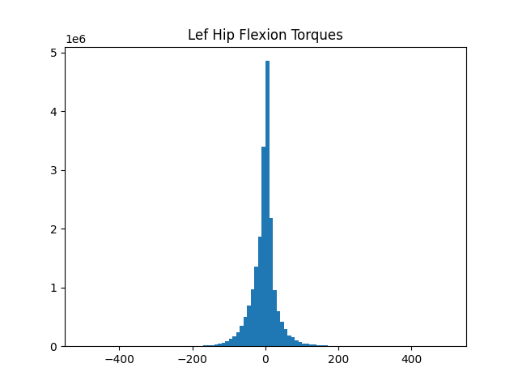

Answering Questions with AddBiomechanics Data
================================================

You can use the AddBiomechanics data to answer questions about the biomechanics of the human body.
Here are a few worked examples, to spark your imagination.

Plotting histograms of joint torques
######################################################################

If you are designing an exoskeleton, you might want to understand the biological torque levels at each joint.

Here is a simple example to get you started::

  import nimblephysics as nimble
  import argparse
  from typing import List
  import numpy as np
  import time
  import os
  import matplotlib.pyplot as plt
  import pandas as pd

  def main(b3d_file_path: str):
      # Load the B3D file
      subjects: List[nimble.biomechanics.SubjectOnDisk] = []
      paths = []
      if os.path.isdir(b3d_file_path):
          for dirpath, dirnames, filenames in os.walk(b3d_file_path):
              for file in filenames:
                  if file.endswith('.b3d'):
                      path = os.path.join(b3d_file_path, file)
                      print(f'Loading {path}')
                      paths.append(file)
                      subjects.append(nimble.biomechanics.SubjectOnDisk(path))
      else:
          assert(b3d_file_path.endswith('.b3d'))
          print(f'Loading {os.path.join(b3d_file_path)}')
          subjects.append(nimble.biomechanics.SubjectOnDisk(b3d_file_path))
      print('Reading first skeleton')
      skel = subjects[0].readSkel(subjects[0].getNumProcessingPasses()-1, ignoreGeometry=True)
      dof_names = []
      for i in range(skel.getNumDofs()):
          dof_names.append(skel.getDofByIndex(i).getName())
      print(dof_names)
      left_hip = dof_names.index('hip_flexion_l')  # positive moves leg forwards, negative moves leg backwards

      left_hip_torques = []

      for s, subject in enumerate(subjects):
          print(f'Processing {s+1}/{len(subjects)}')
          trials = subject.getNumTrials()
          for trial in range(trials):
              length = subject.getTrialLength(trial)
              passes = subject.getTrialNumProcessingPasses(trial)
              frames = subject.readFrames(trial, 0, length, includeSensorData=True, includeProcessingPasses=True)
              for t in range(len(frames)):
                  frame: nimble.biomechanics.Frame = frames[t]
                  if frame.missingGRFReason != nimble.biomechanics.MissingGRFReason.notMissingGRF:
                      continue

                  pos = frame.processingPasses[passes-1].pos
                  taus = frame.processingPasses[passes-1].tau

                  if np.abs(taus[left_hip]) < 500.0:
                      left_hip_torques.append(taus[left_hip])

      left_hip_torques = np.array(left_hip_torques)

      # Plot a histogram of the torques
      plt.hist(left_hip_torques, bins=100, label='Left Hip Torques')
      plt.title('Lef Hip Flexion Torques')
      plt.show()

  if __name__ == "__main__":
      # Create the parser
      parser = argparse.ArgumentParser(description='This loads a set of B3D files, and works out the human + exo torques '
                                                  'involved in simulating the desired virtual body. It can then compute '
                                                  'parameters for a series-elastic-actuator (SEA) to achieve the '
                                                  'desired torque. It can also simulate the SEA, and plot the results')

      # Add an argument
      parser.add_argument('--b3d_file_path',
                          default='../../training_data/train',
                          type=str,
                          help='Path to the b3d file to load, or directory of B3Ds to load')

      # Parse the arguments
      args = parser.parse_args()

      main(os.path.abspath(args.b3d_file_path))

The above script will load a set of B3D files, and plot a histogram of the torques at the left hip joint.

