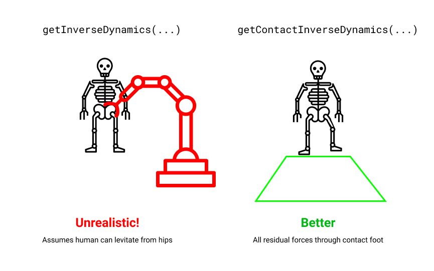

.. _ID:

Computing Skeleton Joint Torques and Forces
===============================================

It can be useful in sports, medicine, exoskeleton control, human-robotic interaction, and other applications 
to know the _forces_ and _torques_ that led to an observed motion. Nimble has many utilities to help with this, though it's a non-trivial problem.

To learn about how to do this, let's recall the definition of a timestep (in matrix notation):

:math:`v_{t+1} = v_t + \Delta t (M^{-1}(C + f_t))`

Here :math:`M` is the mass matrix, and :math:`C` is the coriolis force vector, and :math:`f_t` is the control force applied.

"Plain Vanilla" Inverse Dynamics
#################################################

The basic inverse dynamics problem is to solve for :math:`f_t` necessary to get a given :math:`v_{t+1}` at the next timestep.
Rearranging the timestep equation, we end up with:

:math:`f_t = M(\frac{v_{t+1} - v_t}{\Delta t}) - C`

Note that another name for :math:`\frac{v_{t+1} - v_t}{\Delta t}` is acceleration, which we can denote :math:`a_t`.

In its simplest form, when dealing with a robot arm rigidly attached to a base on the ground, the above equation solves the problem.

This can be solved in code by calling :code:`Skeleton.getInverseDynamics(next_vel)`:

.. code-block:: python

  control_forces = robot.getInverseDynamics(desired_next_vel)

This equation doesn't respect joint force limits, because it's solving a linear system of equations which (if :math:`M` is full rank) has only one solution.

Here we run into problems. Suppose you're analyzing a skeleton that's not firmly attached to the ground (maybe a walking robot, or a human). The root joint of such a skeleton is usually a :code:`FreeJoint`, which encodes the 6 degrees of freedom (3 rotation, 3 translation) to allow the root of the skeleton to move freely relative to the origin.
(For more intuition about these root joints, re-read :ref:`Worlds`). The problem is that :code:`getInverseDynamics(...)` *will apply forces to the root joint!*

That's very unrealistic. It's kind of like attaching your walking robot to an imaginary crane, that's able to exert arbitrary forces and torques at their root joint.
It'd be better if we could somehow ensure that the forces were coming through one or both feet in contact with the ground.

Inverse Dynamics with One Contact
#################################################

Solving that problem is the goal of :code:`getContactInverseDynamics(...)`. This method will only work if your robot's root joint is a :code:`FreeJoint` (or a :code:`FreeEulerJoint`) so that the robot is moving freely through space.
Assuming that's the case, you can ask for a set of joint torques that the robot's motors could actually achieve (leaving the first 6 degrees of freedom un-actuated), and the necessary contact force at the specified contact body.

In code, that looks like this:

.. code-block:: python

  result = robot.getContactInverseDynamics(desired_next_vel, right_foot)
  control_forces = result.jointTorques
  right_foot_contact_force = result.contactWrench

If you're not curious about the math, you can skip to the next section. For the curious-minded, read on:

We'd like to prevent the inverse dynamics solver from applying any un-physical forces at the root (:code:`f_t[0:6] == 0`), which will add 6 equations to our linear system.
That by itself would over-constrain our system, and make it unsolvable, because we'd have :math:`n` variables and :math:`n+6` equations (assuming :math:`n` is the number of degrees of freedom for our skeleton).

We'll resolve that issue by allowing the system to solve for any arbitrary 6-degree-of-freedom "wrench" (that's a 3-dof force *and* a 3-dof torque) at the contact body.
That adds 6 new variables, bringing us to :math:`n+6` variables and :math:`n+6` equations. This is now a solvable system, so let's proceed to solve it (efficiently).

If we introduce the contact wrench :math:`w` and the contact body's `Jacobian <https://www.rosroboticslearning.com/jacobian>`_ :math:`J`, our forward dynamics equation is:

:math:`v_{t+1} = v_t + \Delta t (M^{-1}(C + f_t + J^T w))`

Our inverse dynamics equation now looks like solving for :math:`f_t` and :math:`w` in the following equations:

:math:`f_t = M(\frac{v_{t+1} - v_t}{\Delta t}) - C - J^T w`

:math:`f_t[0:6] = 0`

We can solve this in stages. We know that the first 6 entries of the equation :math:`M(\frac{v_{t+1} - v_t}{\Delta t}) - C - J^T w` must be zero, so that's 6 equations and 6 unknowns, and allows us to solve for :math:`w`:

:math:`w = J^{\dagger T} * (M(\frac{v_{t+1} - v_t}{\Delta t}) - C)[0:6]`

Then we can use :math:`w`, and plug it back into our main equation:

:math:`f_t = M(\frac{v_{t+1} - v_t}{\Delta t}) - C - J^T w`

As a sanity check, the first six entries of :math:`f_t` should be tiny tiny values, and are only non-zero because computers do finite precision arithmetic. We can then safely set them to zero, and return the whole batch.

Inverse Dynamics with Multiple Contacts
#################################################

What if both our robot/person has more than one foot touching the ground?
Following the same strategy outlined in the last section, now we see that our equations no longer have a unique solution.

With :math:`k` feet touching the ground, we have :math:`n+6` equations and :math:`n+6k` variables. That means our system is under-constrained for :math:`k > 1`, and there are lots (infinitely lots, in fact) of potential solutions.

We can choose between these ambiguous solutions in several ways:

- We can pick the nearest set of contact forces to some initial guess
- We can minimize the torques on the contact forces
- We can try to pick smooth contact forces over time, if we're solving multiple timesteps at once

To pick the nearest set of contact forces to some initial guess, expressed as a list of 6-vectors :code:`body_wrench_guesses`:

.. code-block:: python

  result = robot.getMultipleContactInverseDynamics(next_vel, contact_bodies_list, body_wrench_guesses)
  control_forces = result.jointTorques
  first_foot_contact_force = result.contactWrench[0]
  second_foot_contact_force = result.contactWrench[1]

To pick the set of contact forces that minimize the torques at each foot (on the theory that contacts like to produce linear forces, and torques are kind of "imperfections" in the solution), just leave out the guesses:

.. code-block:: python

  result = robot.getMultipleContactInverseDynamics(next_vel, contact_bodies_list)
  control_forces = result.jointTorques
  first_foot_contact_force = result.contactWrenches[0]
  second_foot_contact_force = result.contactWrenches[1]

To solve for inverse dynamics over time, assuming you've got a matrix of :code:`positions` where each column represents one timestep's position vector:

.. code-block:: python

  result = robot.getMultipleContactInverseDynamicsOverTime(positions, contact_bodies_list, smoothingWeight=1.0, minTorqueWeight=1.0)
  n = 0 # some timestep
  step_n_control_forces = result.jointTorques[n,0]
  step_n_first_foot_contact_force = result.contactWrenches[n][0]
  step_n_second_foot_contact_force = result.contactWrenches[n][1]

You can control how the solution trades off between smoothness and minimizing torques with the weighting arguments, :code:`smoothingWeight` and :code:`minTorqueWeight`.