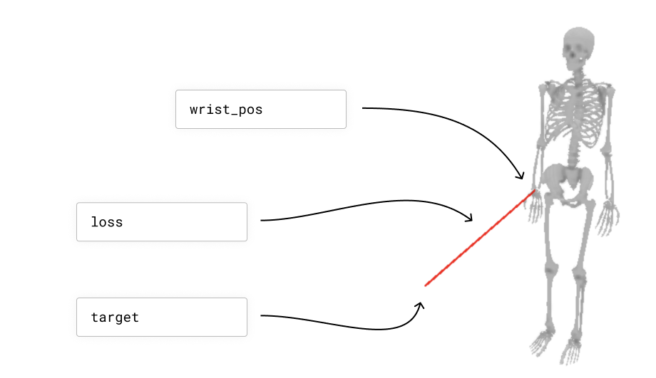
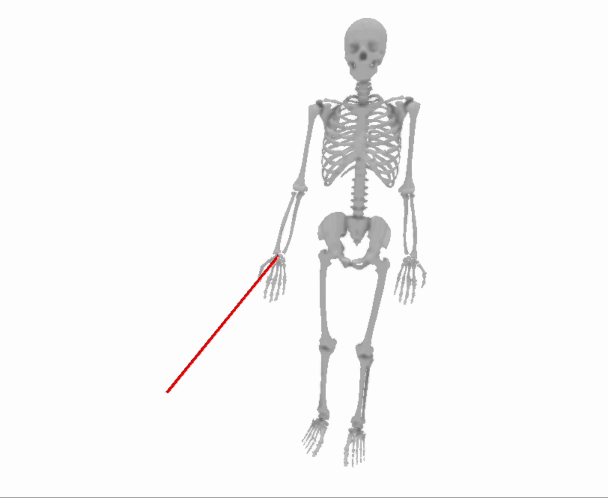

Solving Your Optimization Problems with Skeletons
======================================================

A Brief Intro to Optimization:
##############################

Let's suppose you have a skeleton, and you would like to find the set of joint angles that minimizes the distance between the skeleton's wrist and a target point.
The skeleton's joint angles are your "parameters", and the distance between the skeleton's wrist and the target point is your "loss".
We are going to try to find a setting for the parameters that minimize the loss.

Here is a way to visualize this example problem::

  import nimblephysics as nimble
  import numpy as np
  rajagopal_opensim: nimble.biomechanics.OpenSimFile = nimble.RajagopalHumanBodyModel()
  skeleton: nimble.dynamics.Skeleton = rajagopal_opensim.skeleton
  right_wrist: nimble.dynamics.Joint = skeleton.getJoint("radius_hand_r")

  # Set an arbitrary target location
  target: np.ndarray = np.array([0.5, 0.5, 0.5])

  # Get the world location of the wrist
  wrist_pos: np.ndarray = skeleton.getJointWorldPositions([right_wrist])

  # Create a GUI and serve on port 8080
  gui = nimble.NimbleGUI()
  gui.serve(8080)

  # Render the skeleton to the GUI
  gui.nativeAPI().renderSkeleton(skeleton)

  # Draw a red line connecting the wrist to the target
  gui.nativeAPI().createLine(key="wrist_error", points=[wrist_pos, target], color=[1.0, 0.0, 0.0, 1.0])

  # Compute the loss
  loss = np.linalg.norm(wrist_pos - target)
  print("Loss: "+str(loss))

  # Block until the GUI is closed
  gui.blockWhileServing()

That will create this scenario:

The trouble here is that the relationship between the skeleton's joint angles and the distance between the skeleton's wrist and the target point is complicated.
It is not a simple linear function with a closed form solution.

Happily, computers are fast, and we don't *need* a closed form solution. We just need a way to "bump" a guess for the parameters a tiny bit to make the 
loss a tiny bit smaller, and then we can do that over and over and over again at lightning speed (because computers are fast), and end up with a pretty good answer.

Here is what that process will look like, slowed down by approximately 1000x to make each step more visible:

So the question is: how do we know which way to "bump" our guess for the parameters to make the loss a tiny bit smaller?

What we really need to know is, "if we increase a parameter (for example, the skeleton's elbow angle) a tiny bit, how much does the loss (i.e. the distance between the skeleton's wrist and the target point) change?"
If the answer is that the loss goes down (i.e. the wrist gets closer to the target), which is what we want, we can increase the parameter a tiny bit (i.e. flex the elbow a tiny bit more).
If the answer is that the loss goes *up* (i.e. the wrist gets further away from the target), which is *not* what we want, we can decrease the parameter a tiny bit (i.e. straighten the elbow a tiny bit), 
since presumably that will have the opposite effect as increasing the parameter a tiny bit (this is an important assumption in all of gradient-based optimization, which is the "smoothness" of your function).

It is pretty straightforward to approximately compute the derivative of the loss with respect to the parameters using the "brute force" method, by literally trying out a bunch of different values for the parameters and seeing how the loss changes. However, this is very slow, and we can do better.

What we want is to use calculus and fast C++ code to quickly find the way we can change each of the parameters all at once to make the loss go down as much as possible.
This "how to change every parameter to improve as fast as possible" vector is called the "gradient" of the loss with respect to the parameters.
The gradient is a vector, and it has one entry for each parameter. Each entry tells us how to change that parameter to make the loss go down as much as possible.

Here is some example code to do this optimization, which was used to generate the GIF above::

  import nimblephysics as nimble
  import numpy as np
  import time

  rajagopal_opensim: nimble.biomechanics.OpenSimFile = nimble.RajagopalHumanBodyModel()
  skeleton: nimble.dynamics.Skeleton = rajagopal_opensim.skeleton
  right_wrist: nimble.dynamics.Joint = skeleton.getJoint("radius_hand_r")

  # Set an arbitrary target location
  target: np.ndarray = np.array([0.5, 0.5, 0.5])

  # Create a GUI and serve on port 8080
  gui = nimble.NimbleGUI()
  gui.serve(8080)

  # Get an initial guess for positions
  positions: np.ndarray = skeleton.getPositions()

  for i in range(1000):
    # Render the skeleton to the GUI
    gui.nativeAPI().renderSkeleton(skeleton)

    # Get the world location of the wrist
    wrist_pos: np.ndarray = skeleton.getJointWorldPositions([right_wrist])

    # Draw a red line connecting the wrist to the target
    gui.nativeAPI().createLine(key="wrist_error", points=[wrist_pos, target], color=[1.0, 0.0, 0.0, 1.0])

    # Compute the loss
    loss = np.linalg.norm(wrist_pos - target)
    print("Loss["+str(i)+"]: "+str(loss))

    # Get gradient - we will discuss this more in following sections
    d_loss_d_wrist_pos = 2 * (wrist_pos - target)
    d_wrist_pos_d_joint_angles = skeleton.getJointWorldPositionsJacobianWrtJointPositions([right_wrist])
    d_loss_d_joint_angles = d_wrist_pos_d_joint_angles.T @ d_loss_d_wrist_pos

    # Do not update the pelvis position in the world
    d_loss_d_joint_angles[0:6] = 0.0

    # Update the positions
    positions -= 0.05 * d_loss_d_joint_angles
    skeleton.setPositions(positions)

    time.sleep(0.05)

  # Block until the GUI is closed
  gui.blockWhileServing()

This code is mostly stuff you have seen before, except for the gradient computation, which we will discuss in the following sections.

Computing Gradients (often with Jacobians):
#############################################

Generally, there will be a few intermediate quantities that you need to compute in order to compute the loss from your parameters.

*TODO: section under construction*

How to get access to the derivatives:
##########################################

For some "old school" control algorithms like `Differential Dynamic Programming (DDP) <https://inst.eecs.berkeley.edu/~cs294-40/fa08/scribes/lecture7.pdf>`_, you need access to the Jacobians of dynamics.

If we say the state at time :math:`t` is :math:`s_t`, and the action is :math:`a_t`, then our timestep can be thought of as:

:math:`s_{t+1} = f(s_t, a_t)`

We'd like to be able to access the Jacobians:

:math:`\frac{\partial s_{t+1}}{\partial s_t}` - which we'll call the "state Jacobian" (:code:`stateJac` below)

:math:`\frac{\partial s_{t+1}}{\partial a_t}` - which we'll call the "action Jacobian" (:code:`actionJac` below)

Getting these quantities out of Nimble is easy! Simply call::

  stateJac = world.getStateJacobian()
  actionJac = world.getActionJacobian()

That'll return numpy arrays (`not` PyTorch tensors, computing these Jacobians is not itself differentiable) of the requested Jacobians.

These Jacobians will change as you change either the state or the action, so remember to recompute!

**Performance note**: internally, a call to either :code:`world.getStateJacobian()` or :code:`world.getActionJacobian()` must run a timestep and cache the result.
This means that if you call both without changing either your state or your action, the second Jacobian requested is (almost) free.
Be aware though that the first time you call either :code:`world.getStateJacobian()` or :code:`world.getActionJacobian()` in a given state and action, that'll cost about the same as a call to :code:`nimble.timestep(...)`.