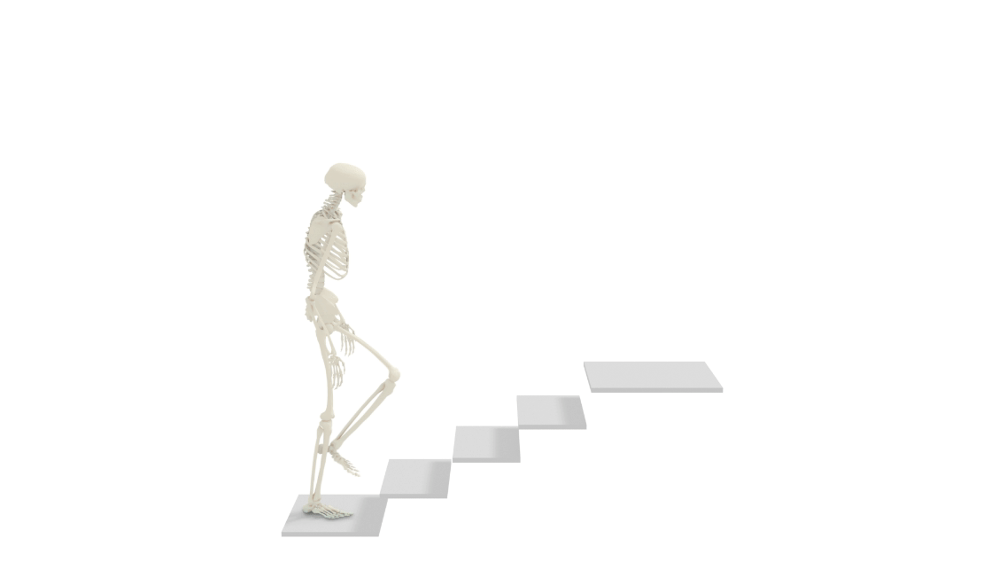
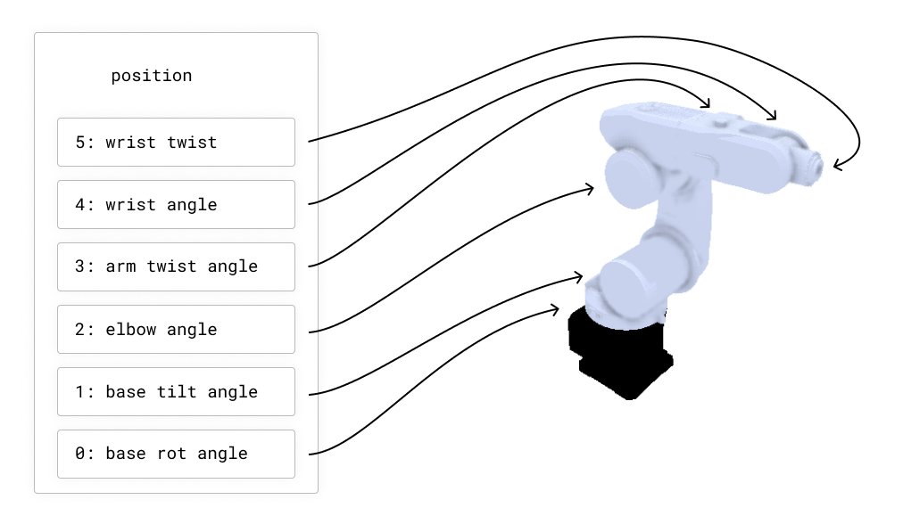
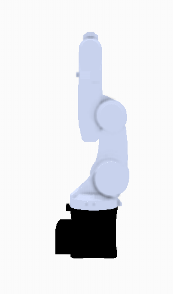
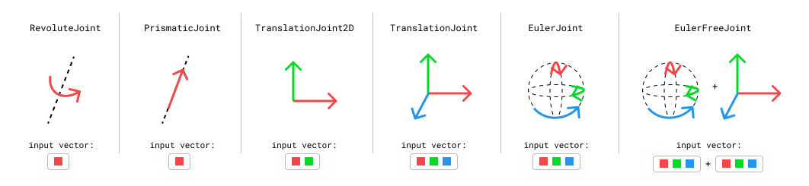
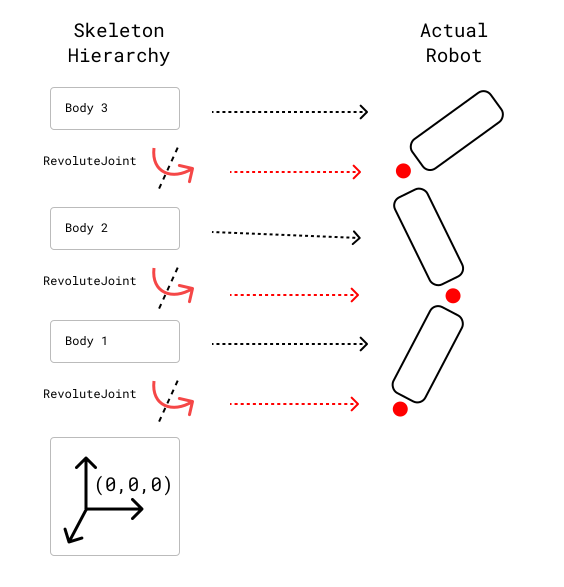
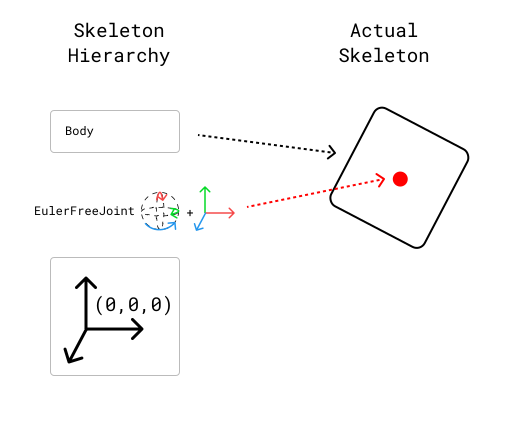

.. _Skeletons:

Understand Skeletons
==========================================

Nimble operates primarily on :code:`nimble.dynamics.Skeleton` objects. Each Skeleton is composed of a set of :code:`nimble.dynamics.Joint`'s, attaching together :code:`nimble.dynamics.BodyNode`'s.
We will start with how to load a skeleton, then discuss how to set its state, and then discuss accessing its pieces (joints and bodies).

Built-in human body model
#################################################

There are many different skeletons used to represent human bodies.
Many skeleton formats are designed to be "good enough" for graphics applications.
For applications where physical accuracy is desired, we turn to the biomechanics literature.
The gold-standard human model in biomechanics is the `Rajagopal 2015 Model <https://simtk.org/projects/full_body/>`_, which we can load from its OpenSim file.
This model comes bundled with Nimble, and is fully differentiable! You can create it with:

.. code-block:: python

  # Create a Rajagopal skeleton
  import nimblephysics as nimble
  rajagopal_opensim: nimble.biomechanics.OpenSimFile = nimble.RajagopalHumanBodyModel()
  skeleton: nimble.dynamics.Skeleton = rajagopal_opensim.skeleton

That will create a skeleton model. In the figure below, we show that skeleton model walking up some stairs:

Loading custom OpenSim models
#################################################

To load a model from an OpenSim file, you can use the :code:`nimble.biomechanics.OpenSimParser` class.

.. code-block:: python

  import nimblephysics as nimble
  import os

  # Load the model
  custom_opensim: nimble.biomechanics.OpenSimFile = nimble.biomechanics.OpenSimParser.parseOsim(os.path.join(
      os.path.dirname(__file__), "./path/to/your/custom_model.osim"))
  skeleton: nimble.dynamics.Skeleton = custom_opensim.skeleton

Visualizing your Skeleton
#################################################

Nimble comes with a built-in GUI that you can use to visualize your work. You can use it like this:

.. code-block:: python

  import nimblephysics as nimble

  # Load the model
  rajagopal_opensim: nimble.biomechanics.OpenSimFile = nimble.RajagopalHumanBodyModel()
  skeleton: nimble.dynamics.Skeleton = rajagopal_opensim.skeleton

  # Create a GUI
  gui = nimble.NimbleGUI()

  # Serve the GUI on port 8080
  gui.serve(8080)

  # Render the skeleton to the GUI
  gui.nativeAPI().renderSkeleton(skeleton)

  # Block until the GUI is closed
  gui.blockWhileServing()

When you run this code, you should see a link in your console to `http://localhost:8080 <http://localhost:8080>`_. If you visit that link, you should see an interactive 3D visualization of your skeleton.

Generalized Coordinates:
##########################

You can try running this code::

  import nimblephysics as nimble
  # Load the model
  rajagopal_opensim: nimble.biomechanics.OpenSimFile = nimble.RajagopalHumanBodyModel()
  skeleton: nimble.dynamics.Skeleton = rajagopal_opensim.skeleton
  # Print the skeleton's position vector
  print(skeleton.getPositions())

When you run the file, you will see a numpy vector of length 37 printed to the console. Nimble works in `generalized coordinates <https://en.wikipedia.org/wiki/Generalized_coordinates>`_, which means that each element of the position vector (which is sometimes called a "degree of freedom") refers to a joint position.

You can find the names of all the degrees of freedom with code like this::

  print([skeleton.getDofByIndex(i).getName() for i in range(skeleton.getNumDofs())])

For example, here are a few of the degrees of freedom in the Rajagopal model:

You can change the position of the knee by changing the values of the joints of the Skeleton and re-running the code::

  import nimblephysics as nimble
  # Load the model
  rajagopal_opensim: nimble.biomechanics.OpenSimFile = nimble.RajagopalHumanBodyModel()
  skeleton: nimble.dynamics.Skeleton = rajagopal_opensim.skeleton
  # Print the skeleton's position vector
  positions = skeleton.getPositions()
  positions[16] = 3.14 / 4
  skeleton.setPositions(positions)

  # Create a GUI
  gui = nimble.NimbleGUI()

  # Serve the GUI on port 8080
  gui.serve(8080)

  # Render the skeleton to the GUI
  gui.nativeAPI().renderSkeleton(skeleton)

  # Block until the GUI is closed
  gui.blockWhileServing()

This will cause the left knee (index 16 in the vector) to rotate backwards by 45 degrees (in radians is PI/4), like in the following figure:

We also express velocity in the same `generalized coordinates` space. For example, if you want the left knee joint to be rotating backwards at 1 radian per second, you can set the velocity of the :code:`skeleton` to::

  velocities = skeleton.getVelocities()
  velocities[9] = 1.0
  skeleton.setVelocities(velocities)

Likewise with acceleration. If we want to decelerate the left knee joint at 1 radian per second squared, we can set the acceleration of the :code:`skeleton` to::

  acceleration = skeleton.getAccelerations()
  acceleration[9] = -1.0
  skeleton.setVelocities(acceleration)

Types of Joints
#################################################

Nimble comes with built-in support for many different Joint types. Here are a few common ones:

- **RevoluteJoint**: This is a joint that takes up a single slot in its :code:`Skeleton.getPositions()` (i.e. it has a single degree-of-freedom), that rotates along an axis. The KR5 robot from the previous section uses only :code:`RevoluteJoint`'s.
- **PrismaticJoint**: This is a joint with a single degree-of-freedom, that translates along an axis.
- **TranslationalJoint2D**: This allows a child to translate in two dimensions relative to its parent. It takes up two slots in its :code:`Skeleton.getPositions()`, since it needs to express both X and Y translation.
- **TranslationalJoint**: This allows a child to translate in all three dimensions relative to its parent. It takes up three slots in its :code:`Skeleton.getPositions()`, since it needs to express X, Y and Z translation.
- **EulerJoint**: This allows a child to rotate freely in 3 dimensions relative to its parent. It is a sequence of 3 :code:`RevoluteJoint`'s.
- **EulerFreeJoint**: This is basically a :code:`TranslationalJoint` glued to a :code:`EulerJoint` for convenience. Its first 3 parameters refer to rotation, using :code:`EulerJoint` semantics, and its last 3 parameters refer to translation.

Skeletons and the Origin
#################################################

Each Skeleton is tree of joints, whose root is `always rigidly attached to the origin`.

This is a key point! `Nothing` in Nimble is "free floating". We simulate things that are "free floating" by including a root joint in the Skeleton that lets the rest of the skeleton move relative to the world.

As an example of something rigidly anchored to the origin, here's an example of how joints connect body nodes together in a cartoon robot arm:

If you want a Skeleton that is free to move around in 3D space, the Skeleton needs to include a joint (or several joints) that allow translation and rotation between the origin and the base of the robot. Here's an example of a box that's free to move and rotate around in 3D space.

We'll see how to construct these Skeletons manually using the Nimble API in future tutorials, but that's enough detail for now.

Listing and Accessing BodyNodes
#################################################

Skeletons are composed of a set of infinitely rigid bodies, usually representing individual bones (like the femur) or groups of bones (like a hand), which Nimble calles :code:`BodyNode`'s.
It can be useful to access individual :code:`BodyNode` instances to get things like the location and rotation of the rigid body in the world, and then use that information to transform 3D points back and forth from body-space to world-space.

To print the names of all the body nodes, you can run::

  import nimblephysics as nimble
  # Load the model
  rajagopal_opensim: nimble.biomechanics.OpenSimFile = nimble.RajagopalHumanBodyModel()
  skeleton: nimble.dynamics.Skeleton = rajagopal_opensim.skeleton
  # Print the names of the body nodes that compose this skeleton
  for i in range(skeleton.getNumBodyNodes()):
    print(skeleton.getBodyNode(i).getName())

To get a particular :code:`BodyNode`, you can get it either based on its index, or its name::

  right_hand_body: nimble.dynamics.BodyNode = skeleton.getBodyNode("hand_r")

Transforming between the World frame and a BodyNode frame
###############################################################

The main useful thing to access in a :code:`BodyNode` is its "world transform", which is a :code:`nimble.math.Isometry3` (an object that contains both rotation and translation)::

  import nimblephysics as nimble
  import numpy as np
  rajagopal_opensim: nimble.biomechanics.OpenSimFile = nimble.RajagopalHumanBodyModel()
  skeleton: nimble.dynamics.Skeleton = rajagopal_opensim.skeleton
  # Optional: set the body in a position with skeleton.setPositions()
  right_hand_body: nimble.dynamics.BodyNode = skeleton.getBodyNode("hand_r")
  right_hand_world_transform: nimble.math.Isometry3 = right_hand_body.getWorldTransform()

To work out where the point (3,2,1) in the right hand's frame corresponds to in world space, we can do::

  test_right_hand_point = np.array([3,2,1])
  world_point = right_hand_world_transform.multiply(test_right_hand_point)
  print(world_point)

And to figure out where the point (1,2,3) in world space maps to in the right hand's frame, we can do::

  test_world_point = np.array([1,2,3])
  right_hand_point = right_hand_world_transform.inverse().multiply(test_world_point)
  print(right_hand_point)

We can also access the translation and rotation of a :code:`nimble.math.Isometry3` directly as Numpy arrays::

  print(right_hand_world_transform.translation())
  print(right_hand_world_transform.rotation())

We will learn more about how the GUI works in a subsequent section, but to visualize a basis (3 vectors representing X, Y, and Z axis of a frame) for the right hand frame and another for the world, we can use the following code::

  import nimblephysics as nimble
  import numpy as np
  rajagopal_opensim: nimble.biomechanics.OpenSimFile = nimble.RajagopalHumanBodyModel()
  skeleton: nimble.dynamics.Skeleton = rajagopal_opensim.skeleton
  # Optional: set the body in a position with skeleton.setPositions()
  right_hand_body: nimble.dynamics.BodyNode = skeleton.getBodyNode("hand_r")
  right_hand_world_transform: nimble.math.Isometry3 = right_hand_body.getWorldTransform()

  # Create a GUI
  gui = nimble.NimbleGUI()

  # Serve the GUI on port 8080
  gui.serve(8080)

  # Render the skeleton to the GUI
  gui.nativeAPI().renderSkeleton(skeleton)

  # Convert the right hand rotation matrix to euler angles
  right_hand_pos = right_hand_world_transform.translation()
  right_hand_euler = nimble.math.matrixToEulerXYZ(right_hand_world_transform.rotation())
  gui.nativeAPI().renderBasis(scale=0.3, pos=right_hand_pos, euler=right_hand_euler, prefix="hand")

  # Render the world basis (which is the default, when renderBasis has no arguments)
  gui.nativeAPI().renderBasis(scale=0.6)

  # Block until the GUI is closed
  gui.blockWhileServing()

That will render the following image (we have added annotations for clarity):

.. image:: _static/figures/body_node_transforms.png
   :width: 400

BodyNode scaling and physical properties
#################################################

Because Nimble primarily works with human bodies, and no two human bodies are exactly the same, it is important to be able to take a generic
skeleton and customize it to represent a specific individual, by changing the sizes of the bones and the masses and inertia of each segment.

To change the size of a bone, you can call :code:`setScale()` with a 3-vector of scales for x, y, and z axis scaling in the local body frame, like follows::

  import nimblephysics as nimble
  import numpy as np
  rajagopal_opensim: nimble.biomechanics.OpenSimFile = nimble.RajagopalHumanBodyModel()
  skeleton: nimble.dynamics.Skeleton = rajagopal_opensim.skeleton
  # Optional: set the body in a position with skeleton.setPositions()
  right_hand_body: nimble.dynamics.BodyNode = skeleton.getBodyNode("hand_r")
  right_hand_body.setScale(np.array([5.0, 5.0, 5.0]))

The above example will make the right hand 5 times larger than "normal" (however that is defined in the Rajagopal skeleton) along all 3 axis.

To set the mass to 5 times larger than the default, we can use::

  right_hand_body.setMass(right_hand_body.getMass() * 5.0)

Listing and Accessing Joints
#################################################

Often it is useful to be able to get individual :code:`Joint` objects out of a skeleton. There are two ways to do this: by index, and by name.

To get all the joints by index, and print their names, you can run::

  import nimblephysics as nimble
  # Load the model
  rajagopal_opensim: nimble.biomechanics.OpenSimFile = nimble.RajagopalHumanBodyModel()
  skeleton: nimble.dynamics.Skeleton = rajagopal_opensim.skeleton
  # Print the skeleton's position vector
  for i in range(skeleton.getNumJoints()):
    print(skeleton.getJoint(i).getName())

To get a joint by name, you can run::

  import nimblephysics as nimble
  # Load the model
  rajagopal_opensim: nimble.biomechanics.OpenSimFile = nimble.RajagopalHumanBodyModel()
  skeleton: nimble.dynamics.Skeleton = rajagopal_opensim.skeleton
  # Print the skeleton's position vector
  print(skeleton.getJoint("knee_left"))

Joint World Locations
#################################################

Each joint has a "center" point in 3D space. This is generally the point that the joint rotates around. For joints like a :code:`RevoluteJoint`, 
where it actually rotates around a whole axis, the joint center can be anywhere along that line, depending on how the Skeleton is set up. Generally, 
the joint center is where you would intuitively expect it to be: for example, the elbow joint center is at the actual physical elbow, and not floating 
off in space along the rotational axis of the elbow. But when debugging, this is an edge case to be aware of.

You can get the world location of a joint center with code like this::

  import nimblephysics as nimble
  # Load the model
  rajagopal_opensim: nimble.biomechanics.OpenSimFile = nimble.RajagopalHumanBodyModel()
  skeleton: nimble.dynamics.Skeleton = rajagopal_opensim.skeleton

  # Print the root joint's position
  joint_index = 0
  print(skeleton.getJointWorldPosition(joint_index))

  # Print a dictionary of key-value pairs, where the key is the joint name and the value is the joint world position
  print(skeleton.getJointWorldPositionsMap())

  # Get and print a concatenated vector of joint centers
  joints = [skeleton.getJoint(i) for i in range(skeleton.getNumJoints())]
  joint_positions = skeleton.getJointWorldPositions(joints)

Getting a list of joint centers concatenated together might appear to be an unnecessarily cumbersome API, but it will come in handy later when we are discussing gradients.