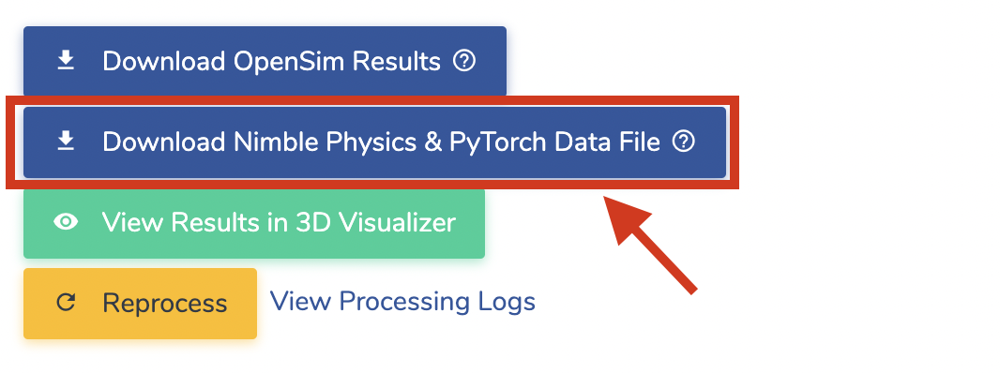
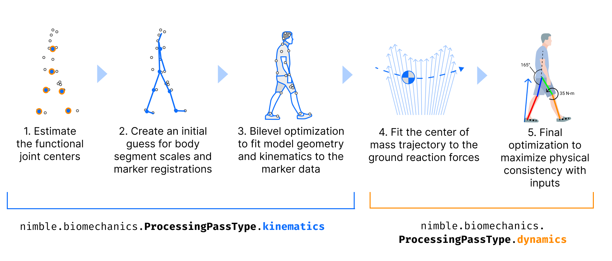

Working with AddBiomechanics Data
====================================

What is AddBiomechanics?
##########################################

`AddBiomechanics <https://addbiomechanics.org/>`_ is an open source cloud-based motion capture processing tool, built by the same people behind Nimble.
It is designed to be a simple, easy to use, and free way to process motion capture data, and get it into a format that is easy to use for biomechanics research.
The tool automates previously time-consuming and error-prone steps in the motion capture processing pipeline, such as scaling a skeleton model, tweaking marker placement on the model, and tuning the link masses and motion to match experimental force data.
You can learn more at the `AddBiomechanics Webinar <https://mobilize.stanford.edu/webinar-addbiomechanics-lowering-the-barriers-to-musculoskeletal-modeling-and-large-scale-discoveries-in-biomechanics/>`_, 
or from the `paper in PLOS One <https://journals.plos.org/plosone/article?id=10.1371/journal.pone.0295152>`_.

Most importantly, AddBiomechanics requires that all data that is uploaded to the tool *be made available to the public, so that anyone can use it for research!*

If you're reading this, in all likelihood you're interested in using AddBiomechanics data for research, not using the AddBiomechanics tool itself for motion 
capture processing. This page will help you understand how to use AddBiomechanics data, whether to train ML models, or to do fundamental biomechanics research.

Where can I download the aggregated data?
##########################################

You can download three sample B3D files from `here <https://drive.google.com/drive/folders/1wF2LnjyCQ7A-nwJUECffQCMJIHOCt9qu?usp=drive_link>`_.

Our first big public dataset release is still in peer review, and will be made publicly available when it is accepted.

We plan to periodically release public snapshots of the dataset from AddBiomechanics, as we clean it and manually verify quality. The main challenge is 
that the data is very large (100+ hours and counting), and we want to make sure that we're releasing data that is as clean as possible, so that 
you can trust it for your research.

How can I download my own lab's data?
##########################################

If you are processing your own data on `AddBiomechanics <https://addbiomechanics.org/>`_ (or if someone else sent you a link to their data), you can get 
data out in two formats. One is the "standard" OpenSim format, which is a zip of a folder with a bunch of files in it which you can work with using 
`OpenSim <https://simtk.org/projects/opensim>`_. The other is a single :code:`*.b3d` file, which is an efficient binary file that contains all the data 
for all the trials you've processed, and can be read with Nimble.

The AddBiomechanics GUI will let you download either of these formats. If you want to download the :code:`*.b3d` file, you can do so by clicking the 
"Download Results, B3D Format" button.

IMPORTANT NOTE: Please try to minimize the number of times you download the data (definitely do not download the same file over and over 
again from our servers in a script) because AWS charges us extortionate fees for downloads, and it adds up quite quickly. It's better to download your 
subject files once, and then put the files on your local Google Drive, Drobox, or other cloud storage, and then re-download from there if you need it on other machines.

Contents of a B3D File
##########################################

A B3D file on disk contains a compressed binary representation of all the data for all the trials you've processed for a single subject, along with the 
scaled and mass-tuned skeleton model, and all the raw sensor inputs.

AddBiomechanics works on your data in "passes", and records each pass separately in the B3D.

The "kinematics" pass, labeled with the enum :code:`nimble.biomechanics.ProcessingPassType.kinematics`, uses only the marker data to solve for the
skeleton's bone scales, marker offsets on the bones, and the poses of the skeleton for each frame.

The "dynamics" pass, labeled with the enum :code:`nimble.biomechanics.ProcessingPassType.dynamics`, takes as input the previous pass outputs 
(generally the kinematics pass), and then further solves for the mass distribution, fine tunes bone scales, and tunes motion of the skeleton 
that best matches the experimental force data.

There is another kind of pass, the "low pass filter" pass, labeled with the enum :code:`nimble.biomechanics.ProcessingPassType.lowPassFilter`, which
does exactly what it says on the tin: takes the output of the previous pass, and applies a low pass filter to it. AddBiomechanics will generally apply
a low pass filter to the output of each :code:`kinematics` pass, before using it as input to the :code:`dynamics` pass. It may also apply another low pass filter
to the output of the :code:`dynamics` pass.

Importantly, the outputs from every processing pass are saved separately in the B3D file, so you can go back and see what came out of each pass!

This is especially important for machine learning projects that are trying to predict physical data (like ground reaction force or joint torques) from motion data.
If you want to train a model to predict ground reaction force, you should use as input features only the :code:`kinematics` pass, because that data has never 
"seen" the force plate data during optimization. If you use the output of the :code:`dynamics` pass, you will be training your model on data that has already been
fine tuned to match the force plate data, and your model will overfit to the clues that the optimizer inserts into the motion to match the force plate data!

Loading and Visualizing Skeletons from a B3D
#############################################

It always helps to see what you are doing, so let's start by loading a skeleton from a B3D file, and visualizing it in the Nimble GUI.
Let's assume you have downloaded a `the Falisse2017_subject_1.b3d sample file <https://drive.google.com/file/d/17-_zrL_3GufFpN-1x8xksgpYRUW9Ju0n/view?usp=drive_link>`_ to :code:`your/path/Falisse2017_subject_1.b3d`.

Further, let us assume that you have downloaded the generic bone geometry library to :code:`some/folder/path/to/Geometry`. You can get that from `here <https://drive.google.com/file/d/1JRPtO67Pk9oPnmErzPha4jJT74ltxVm1/view?usp=sharing>`_.

.. code-block:: python

  import nimblephysics as nimble

  # Load the model
  your_subject = nimble.biomechanics.SubjectOnDisk("your/path/Falisse2017_subject_1.b3d")
  # Read the skeleton that was optimized by the first process pass (always kinematics)
  # Use the geometryFolder argument to specify where to load the bone mesh geometry from
  skeleton: nimble.dynamics.Skeleton = your_subject.readSkel(
      processingPass=0,
      geometryFolder="some/folder/path/to/Geometry")

  # Create a GUI
  gui = nimble.NimbleGUI()

  # Serve the GUI on port 8080
  gui.serve(8080)

  # Render the skeleton to the GUI
  gui.nativeAPI().renderSkeleton(skeleton)

  # Block until the GUI is closed
  gui.blockWhileServing()

You can then open a browser to `http://localhost:8080 <http://localhost:8080>`_ to see the skeleton in the GUI.

But that's not very interesting, because it's just a skeleton in a neutral pose. Let's also load and render some motion data!
To do that, we will use the :code:`readFrames` method on :code:`SubjectOnDisk`, which will load (as many as we request) 
:code:`Frame` objects from the B3D file. The :code:`Frame` objects contain all the information about the skeleton's state at that frame,
and contain information for each processing pass separately. If we do this in a loop, we can animate the skeleton in the GUI!

.. code-block:: python

  import nimblephysics as nimble
  from typing import List
  import time

  # Load the model
  your_subject = nimble.biomechanics.SubjectOnDisk("your/path/Falisse2017_subject_1.b3d")
  # Read the skeleton that was optimized by the first process pass (always kinematics)
  # Use the geometryFolder argument to specify where to load the bone mesh geometry from
  skeleton: nimble.dynamics.Skeleton = your_subject.readSkel(
      processingPass=0,
      geometryFolder="some/folder/path/to/Geometry")

  # Create a GUI
  gui = nimble.NimbleGUI()

  # Serve the GUI on port 8080
  gui.serve(8080)

  # A B3D file contains multiple trials of data, so we need to select which one we want to load
  trial = 0

  # Load all the frames from the selected trial
  trial_frames: List[nimble.biomechanics.Frame] = your_subject.readFrames(
      trial=trial,
      processingPass=0,
      startFrame=0,
      numFramesToRead=your_subject.getTrialLength(trial))

  # Figure out how many (fractional) seconds each frame represents
  seconds_per_frame = your_subject.getTrialTimestep(trial)

  # Loop through all the frames, and render them to the GUI
  frame = 0
  while True:
      # Get the frame we want to render
      frame_to_render = trial_frames[frame]
   
      # Set the skeleton's state to the state in the frame
      skeleton.setPositions(frame_to_render.processingPasses[0].pos)
   
      # Render the skeleton to the GUI
      gui.nativeAPI().renderSkeleton(skeleton)
   
      # Sleep for the appropriate amount of time
      time.sleep(seconds_per_frame)
   
      # Increment the frame counter
      frame += 1
      if frame >= len(trial_frames):
         frame = 0

That should loop through the frames of trial 0, and display them to the GUI. There is a LOT more you can do with a B3D file, but this should get you started!

Machine Learning with B3D Files
##########################################

A reference for training ML models with B3D files is available in the `InferBiomechanics repo <https://github.com/keenon/InferBiomechanics>`_.
That repo trains a model to predict ground-reaction-force and joint torques from motion data, and is a good starting point for training your own models.

B3D files are laid out on disk so that you can efficiently load frames at random from the file, without loading 
the entire file into memory. This is helpful for training ML systems on large amounts of training data, which might otherwise overwhelm the amount
of RAM available on your machine.

To load a file at :code:`your/path/your_subject_name.b3d`, simply instantiate a :code:`your_subject = nimble.biomechanics.SubjectOnDisk("your/path/your_subject_name.b3d")`.
Note that instantiating :code:`SubjectOnDisk` *does not* load all the trials into memory, it merely keeps a lightweight index of the file in memory, which can then load 
arbitrary frames of trials quickly and efficiently. It's safe to load an enormous number of :code:`SubjectOnDisk` files simultaneously, even with very limited RAM.

Once you have a :code:`SubjectOnDisk`, the main point of a :code:`SubjectOnDisk` is to load arrays of :code:`Frame` objects by calling :code:`frames = your_subject.readFrames(...)`.
Each :code:`Frame` contains all the information to set the state of the skeleton corresponding to this subject, which you can get copies of by calling :code:`skel = your_subject.readSkel(...)`.
With a skeleton set in the correct state, with contact and dynamics information known, you're ready to derive any additional information you need to train your ML system!

Performance Considerations for Machine Learning with B3Ds
################################################################

When training AI models, it is very often the case that you are bottlenecked not by the speed of your floating point units on the GPU, but by the speed at which you can deliver them data.
When paging through hundreds of gigabytes of motion data from disk at random, it is important to be able to do so efficiently. We recommend a multi-threaded loader. A reference is available in the `InferBiomechanics repo <https://github.com/keenon/InferBiomechanics>`_.
Check out the `dataset implementation <https://github.com/keenon/InferBiomechanics/blob/main/src/data/AddBiomechanicsDataset.py>`_ and the `training implementation <https://github.com/keenon/InferBiomechanics/blob/3505d4240d1e69bc579a9153eac00cec9e580df5/src/cli/train.py#L147C34-L147C34>`_.

The key is using PyTorch's :code:`DataLoader` class with :code:`num_workers` more than 1. This will allow you to load data from disk in parallel with training, which is critical for training large models on large datasets.
The trick is that PyTorch's parallel implementation relies on being able to pickle the :code:`Dataset` you're loading from, which will contain a bunch of :code:`nimble.biomechanics.SubjectOnDisk` objects, but :code:`nimble.biomechanics.SubjectOnDisk` is not picklable.
To get around this, you must implement :code:`__getstate__` and :code:`__setstate__` for your :code:`Dataset` class to pickle the SubjectOnDisk files as simply their path on disk (with an example `here <https://github.com/keenon/InferBiomechanics/blob/3505d4240d1e69bc579a9153eac00cec9e580df5/src/data/AddBiomechanicsDataset.py#L266>`_), and then recreate them on unpickling (`here <https://github.com/keenon/InferBiomechanics/blob/3505d4240d1e69bc579a9153eac00cec9e580df5/src/data/AddBiomechanicsDataset.py#L274>`_).
This is ok to do, because :code:`SubjectOnDisk` is extremely lightweight, and can be recreated very quickly. It only loads a very small header from the file into memory, so that it knows where to seek to read frames as requested.
Having lots of copies of :code:`SubjectOnDisk` in memory in different processes is not a problem, because they are each so lightweight.

API Reference
##########################################

.. autoclass:: nimblephysics.biomechanics.SubjectOnDisk
   :members:
   :undoc-members:
   :private-members:

.. autoclass:: nimblephysics.biomechanics.Frame
   :members:
   :undoc-members:
   :private-members:

.. autoclass:: nimblephysics.biomechanics.FramePass
   :members:
   :undoc-members:
   :private-members: