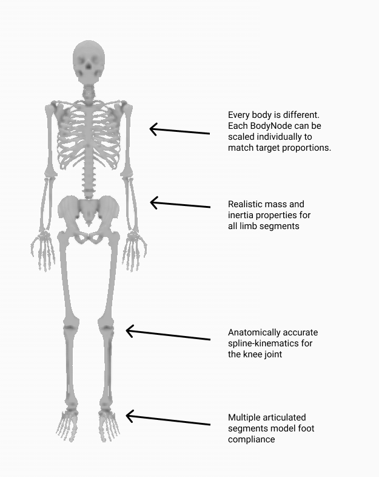

Differentiable Human Body Models
================================

One of our main motivations for building Nimble was to support research at the intersection of Biomechanics and AI.

To support that goal, Nimble contains lots of tools for working with differentiable human bodies.

Biomechanics-quality human body model
#################################################

There are many different skeletons used to represent human bodies.
Many skeleton formats are designed to be "good enough" for graphics applications.
For applications where physical accuracy is desired, we turn to the biomechanics literature.
The gold-standard human model in biomechanics is the `Rajagopal 2015 Model <https://simtk.org/projects/full_body/>`_, which we've ported from OpenSim.
This model comes bundled with Nimble, and is fully differentiable! You can create it with:

.. code-block:: python

  # Create a Rajagopal skeleton and add it to the world

  human: nimble.biomechanics.OpenSimFile = nimble.RajagopalHumanBodyModel()
  world.addSkeleton(human.skeleton)

That will create a skeleton that looks like the figure below. We've called out some of the features of the skeleton in the doc.

Converting motion between skeleton types
#################################################

Often you'll find motion capture datasets you want to use for your project, but they use different skeleton definitions.

Not to fear, we've got a tool for easily retargetting motion across skeleton types! Let's suppose you've got two skeletons, :code:`dataSourceSkeleton` and :code:`mySkeleton`.
You've got motion data in the form of a sequence of poses for :code:`dataSourceSkeleton`, and you'd like to get equivalent motion data for :code:`mySkeleton`.

The first thing to do is create a :code:`biomechanics.SkeletonConverter` object:

.. code-block:: python

  converter: nimble.biomechanics.SkeletonConverter = nimble.biomechanics.SkeletonConverter(
      mySkeleton, dataSourceSkeleton)

Next up, we can register the joints across the two bodies that represent the same actual joint on the human body.
This doesn't need to be all the joints! Often skeletons will disagree on exactly which joints to express, especially around the shoulders and in the feet.
We just need a couple of key points along the body, and the more the better.

For example, here's a mapping from an `AMASS <https://amass.is.tue.mpg.de/>`_ skeleton to the Rajagopal skeleton bundled with Nimble:

.. code-block:: python

  converter.linkJoints(mySkeleton.getJoint("radius_hand_l"), dataSourceSkeleton.getJoint("wrist_l"))
  converter.linkJoints(mySkeleton.getJoint("radius_hand_r"), dataSourceSkeleton.getJoint("wrist_r"))
  converter.linkJoints(mySkeleton.getJoint("ankle_l"), dataSourceSkeleton.getJoint("ankle_l"))
  converter.linkJoints(mySkeleton.getJoint("ankle_r"), dataSourceSkeleton.getJoint("ankle_r"))
  converter.linkJoints(mySkeleton.getJoint("mtp_l"), dataSourceSkeleton.getJoint("foot_l"))
  converter.linkJoints(mySkeleton.getJoint("mtp_r"), dataSourceSkeleton.getJoint("foot_r"))
  converter.linkJoints(mySkeleton.getJoint("walker_knee_l"), dataSourceSkeleton.getJoint("knee_l"))
  converter.linkJoints(mySkeleton.getJoint("walker_knee_r"), dataSourceSkeleton.getJoint("knee_r"))
  converter.linkJoints(mySkeleton.getJoint("acromial_l"), dataSourceSkeleton.getJoint("shoulder_l"))
  converter.linkJoints(mySkeleton.getJoint("acromial_r"), dataSourceSkeleton.getJoint("shoulder_r"))
  converter.linkJoints(mySkeleton.getJoint("elbow_l"), dataSourceSkeleton.getJoint("elbow_l"))
  converter.linkJoints(mySkeleton.getJoint("elbow_r"), dataSourceSkeleton.getJoint("elbow_r"))
  converter.linkJoints(mySkeleton.getJoint("hip_l"), dataSourceSkeleton.getJoint("hip_l"))
  converter.linkJoints(mySkeleton.getJoint("hip_r"), dataSourceSkeleton.getJoint("hip_r"))

Once you've registered the joints, you can now ask the converter to rescale your skeleton to match the proportions of the data source skeleton, and register how the limbs match up for future conversion.

.. code-block:: python

  converter.rescaleAndPrepTarget()

This shouldn't take long to complete, and will do its best to scale and orient your skeleton so that the joints you've linked up will occupy exactly the same spot in physical space, so that poses can be matched precisely.

Once everything is prepared, and assuming your time-series motion data from your data source is organized as a matrix :code:`dataSourceSkeletonPoses` where each column represents one timestep, then converting motion from the data source skeleton to your new skeleton is as easy as:

.. code-block:: python

  mySkeletonPoses = converter.convertMotion(
    dataSourceSkeletonPoses, logProgress=True)

Now you have a matrix :code:`mySkeletonPoses` where each column contains the position for :code:`mySkeleton` that most closely matches :code:`dataSourceSkeleton` at the corresponding column in :code:`dataSourceSkeletonPoses`.

Doing real-time IK (ex. working with Azure Kinect sensors)
#############################################################

Some skeleton formats, like `Azure Kinect DK <https://docs.microsoft.com/en-us/azure/kinect-dk/body-joints>`_, just provide a list of all the joints in world space.

We can rapidly fit a skeleton to those joints using built-in IK methods on the :code:`Skeleton` object itself.

Suppose we have a List of joint world positions as 3-vectors (like from a Kinect sensor), called :code:`targetPositions`.
Also, suppose we've pre-made a list of the corresponding joints in our model, called :code:`bodyJoints`.
Then, to fit our :code:`Skeleton` object called :code:`human` to the pose data from the Kinect, we can just call:

.. code-block:: python

  human.fitJointsToWorldPositions(bodyJoints, targetPositions)

If we'd like to automatically rescale the skeleton as well as positioning it, we can pass the flag :code:`scaleBodies=True`, as in:

.. code-block:: python

  human.fitJointsToWorldPositions(bodyJoints, targetPositions, scaleBodies=True)

Working with marker data
#################################################

Often we have a set of markers mounted on the body, and their 3D positions in world space. For example, this is common in marker-based mocap pipelines.

If you know how many markers you have, which :code:`BodyNode` they're mounted to and at what offset they're mounted, and where they are in 3D space, there's a convenient method to run IK to position (and optionally scale) the skeleton to fit the markers as closely as possible.

Let's dig into how the markers are specified with an example. Let's consider the following code:

.. code-block:: python

  human: nimble.dynamics.Skeleton = nimble.RajagopalHumanBodyModel()

  markers = []
  markers.append((human.getBody("tibia_l"), [0,0.1,0]))
  markers.append((human.getBody("tibia_r"), [0.1,0,0]))

Each marker is a pair, :code:`(BodyNode, offset)`, which registers which :code:`BodyNode` the marker is mounted to, and what offset (in local space for that :code:`BodyNode`) the marker is mounted at.
The above example creates two markers. The fist one is mounted 0.1 units along the Y-axis (in local space) from the left tibia (shin bone). The second one is mounted 0.1 units along the X-axis (in local space) from the right tibia.

Once we've got our markers, a list of their world positions in :code:`targetPositions`, we only need one more thing. Each marker needs a weight, to tell the IK system how to trade off between different fits when it can't fit all the markers exactly.
You can pass in a vector of 1's (the same length as the :code:`markers` List) if you want every marker to be treated equally. If you put a 2 in the weights array somewhere, the marker at that index will be weighted twice as much as another marker that has weight 1 when trying to fit the pose of the skeleton.

With all that in place, we can call:

.. code-block:: python

  human.fitMarkersToWorldPositions(markers, targetPositions, weights)

That'll move the :code:`human` skeleton to fit the markers as closely as possible. If you'd like to also automatically rescale the skeleton, you can use the :code:`scaleBodies=True` flag:

.. code-block:: python

  human.fitMarkersToWorldPositions(markers, targetPositions, weights, scaleBodies=True)

Reconstructing joint forces from motion
#################################################

This is called the "inverse dynamics" problem, and is so important that we've actually got a whole page devoted to it. Check out :ref:`ID` for details!