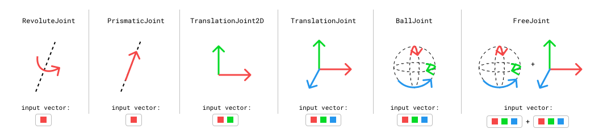
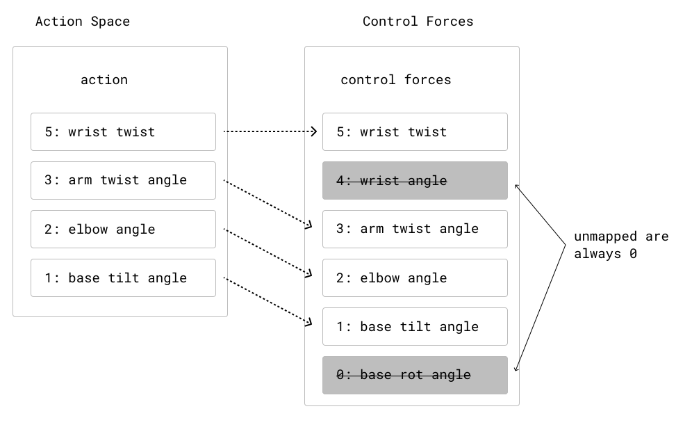

.. _Worlds:

Understand Worlds and Skeletons
==========================================

Nimble models a World as a set of Skeletons. Each Skeleton is composed of a set of joints, attaching together rigid bodies.
We'll first understand how Skeletons work, and then we'll discuss how Worlds add convenient methods for groups of Skeletons.

Generalized Coordinates: Position and Velocity
#################################################

As a first example, we'll use the :download:`KR5 Robot <./_static/robots/KR5.zip>`. That zip file contains a KR5 robot in URDF format, a convenient ground object, meshes to use when rendering the robot, and a :code:`demo.py` file that contains the following code::

  import nimblephysics as nimble
  import os

  world: nimble.simulation.World = nimble.simulation.World()
  arm: nimble.dynamics.Skeleton = world.loadSkeleton(os.path.join(
      os.path.dirname(__file__), "./KR5.urdf"))

  # Your code here

  gui = nimble.NimbleGUI(world)
  gui.serve(8080)
  gui.blockWhileServing()

When you run it, you should see a KR5 robot in your browser. We'll use this as our running example as we explain basic concepts in Nimble.

Where it says "Your code here", you can insert the code::

  print(arm.getPositions())

When you run the file, you will see a numpy vector of length 6 printed to the console. Nimble works in `generalized coordinates <https://en.wikipedia.org/wiki/Generalized_coordinates>`_, which means that each element of the position vector (which is sometimes called a "degree of freedom") refers to a joint position.

.. image:: _static/figures/generalized_coords.png
   :width: 600

You can change the position of the arm by changing the values of the joints of the Skeleton and re-running the code::

  arm.setPositions([0, 0, -90*(3.1415/180), 0, 0, 0])

This will cause the arm to point straight up at the sky, by telling the elbow (index 2 in the vector) to rotate backwards by 90 degrees, like in the following figure:

.. image:: _static/figures/generalized_coords_2.png
   :width: 200

We also express velocity in the same `generalized coordinates` space. For example, if you want the elbow joint to be rotating forwards at 1 radian per second, you can set the velocity of the :code:`arm` to::

  arm.setVelocities([0, 0, 1, 0, 0, 0])

Types of Joints
#################################################

Nimble comes with built-in support for many different Joint types. Here are a few common ones:

- **RevoluteJoint**: This is a joint that takes up a single slot in its :code:`Skeleton.getPositions()` (i.e. it has a single degree-of-freedom), that rotates along an axis. The KR5 robot from the previous section uses only :code:`RevoluteJoint`'s.
- **PrismaticJoint**: This is a joint with a single degree-of-freedom, that translates along an axis.
- **TranslationalJoint2D**: This allows a child to translate in two dimensions relative to its parent. It takes up two slots in its :code:`Skeleton.getPositions()`, since it needs to express both X and Y translation.
- **TranslationalJoint**: This allows a child to translate in all three dimensions relative to its parent. It takes up three slots in its :code:`Skeleton.getPositions()`, since it needs to express X, Y and Z translation.
- **BallJoint**: This allows a child to rotate freely in 3 dimensions relative to its parent. Unlike a sequence of 3 :code:`RevoluteJoint`'s, this does not suffer from `Gimbal Lock <https://en.wikipedia.org/wiki/Gimbal_lock>`_, because it uses `exponential coordinates <https://en.wikipedia.org/wiki/Axis%E2%80%93angle_representation>`_ to store rotations. This has 3 degrees of freedom.
- **FreeJoint**: This is basically a :code:`TranslationalJoint` glued to a :code:`BallJoint` for convenience. Its first 3 parameters refer to rotation, using :code:`BallJoint` semantics, and its last 3 parameters refer to translation.

Skeletons and the Origin
#################################################

Each Skeleton is tree of joints, whose root is `always rigidly attached to the origin`.

This is a key point! `Nothing` in Nimble is "free floating". We simulate things that are "free floating" by including a root joint in the Skeleton that lets the rest of the skeleton move relative to the world.

As an example of something rigidly anchored to the origin, here's an example of how joints connect body nodes together in a cartoon robot arm:

.. image:: _static/figures/skeleton_hierarchy.svg
   :width: 400

If you want a Skeleton that is free to move around in 3D space, the Skeleton needs to include a joint (or several joints) that allow translation and rotation between the origin and the base of the robot. Here's an example of a box that's free to move and rotate around in 3D space.

.. image:: _static/figures/skeleton_hierarchy_free.svg
   :width: 400

We'll see how to construct these Skeletons manually using the Nimble API in future tutorials, but that's enough detail for now.

Putting it Together: The World
#################################################

The World is just a list of Skeleton objects. Each Skeleton is attached to the same origin point.
Their position vectors are concatenated together to form the World's position vector, in the order the skeletons were added to the world.

When there's only a single skeleton in the world, as in our :download:`KR5 Robot <./_static/robots/KR5.zip>` example from earlier, then::

  world.getPositions() == arm.getPositions() # True

When there's more skeletons, each skeleton's :code:`getPositions()` vector will be mapped to a section of the World's :code:`getPosition()` vector.

Likewise, :code:`setPositions()`, :code:`getVelocities()`, :code:`setVelocities()` all work the same way.

As a convenience, the World object also allows you to deal with position and velocity at the same time using the :code:`getState()` and :code:`setState()` methods.
:code:`getState()` returns the vector from :code:`setPositions()` concatenated to :code:`getVelocities()`. Likewise, :code:`setState()` will take the first half of the passed in vector and use it to :code:`setPositions()`, and the second half to call :code:`setVelocities()`.

Control Forces and the Action Space
#################################################

So far, we've learned how to understand our Skeletons, combine them in a World, and control their position and velocity.

Often, though, we're interested in modelling situtations where our robots are able to use motors to control themselves.

To simulate this, Nimble allows you to set "control forces" on Skeletons. Each degree of freedom (i.e. each index in the position vector) can have a "control force" applied to it of your choosing.

Returning to our :download:`KR5 Robot <./_static/robots/KR5.zip>` example from earlier, let's try the command::

  world.setControlForces([0, 0, 1, 0, 0, 0])

This will apply a force to the elbow joint of our robot, which will have an effect when we run the next timestep.

By default, we can control all the degrees of freedom of our robots. Sometimes, however, this isn't desirable.
If you're learning a control strategy for a walking robot, you don't want the control strategy to learn to apply force to the root FreeJoint that you use to attach the robot to the origin to allow it to move around.

To make this more convenient, the World object offers the idea of the "Action Space". The Action Space is a configurable map onto the control forces,
where by excluding forces from the action space you can ensure they're always set to 0 (no applied force).

The concept of an Action Space is convenient, because it means you can use `unconstrained` learning algorithms to control forces, while keeping some at 0.

To get the configuration in the above figure, you could call::

  world.removeDofFromActionSpace(4)
  world.removeDofFromActionSpace(0)

Then you can call::

  world.setAction([1,2,3,4])

And that's effectively the same as calling::

  world.setControlForces([0,1,2,3,0,4])